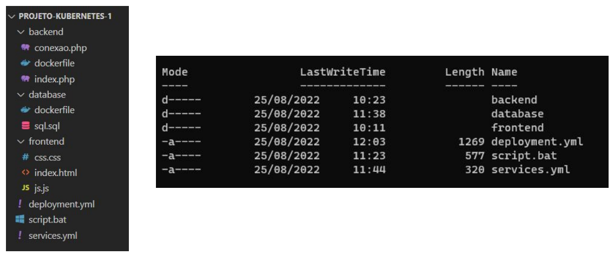
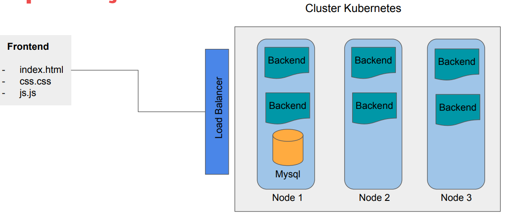

# Projeto 1: Criando um Deploy de uma Aplicação

Nesse repositório estão contidos os códigos de um dos desafios ocorridos no curso de Linux, parte do Bootcamp **"Jornada DevOps com AWS - Impulso"**, organizada pelo portal [DIO](https://www.dio.me/), no período de outubro a dezembro de 2022. 

## Desafio
Neste projeto será realizado um deploy de uma aplicação completa com frontend, backend e database mysql. No desenvolvimento do projeto serão criadas as imagens dos containeres e serviços necessários no kubernetes para que a aplicação esteja pronta para produção.

### Código fonte da aplicação 

[denilsonbonatti](https://github.com/denilsonbonatti/k8s-projeto1-app-base)

### Estrutura das pastas

### Arquitetura do Cluster e Aplicação

